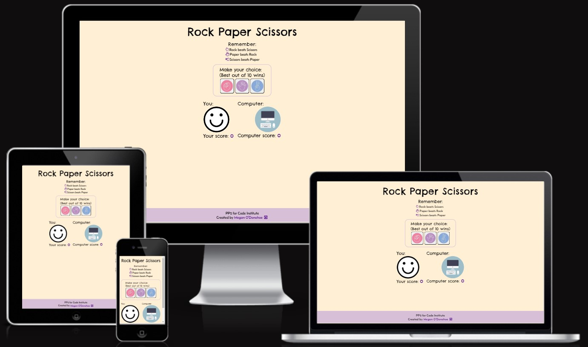
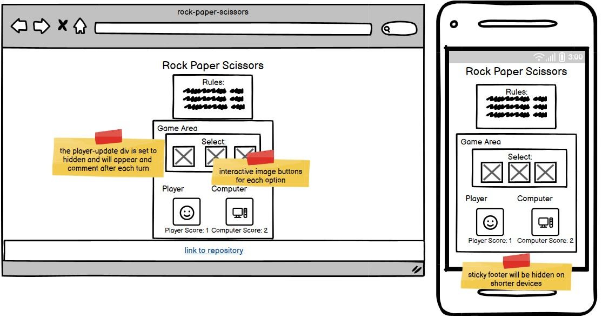

# **Rock Paper Scissors**

## **Site Overview**

The entertaining classic game of chance available for all devices. Play against the computer - the first to score 10 wins.

## **Table Of Contents**

---

1. [**Site Overview**](#site-overview)
2. [**Project Goals**](#project-goals)
   - [Site Owner Goals](#site-owner-goals)
   - [How This Will Be Achieved](#how-this-will-be-achieved)
3. [**UX**](#ux)
   - [Strategy and Scope]
     - [User Stories](#user-stories)
     - [User Requirements](#user-requirements)
   - [Structure and Skeleton](#structure-and-skeleton)
     - [Wireframes](#wireframes)
   - [Current Features](#current-features)
     - [404 Page](#404-page)
   - [Surface](#surface)
     - [Color Scheme](#color-scheme)
     - [Font](#font)
4. [**Testing and Validation**](#testing-and-validation) \* bugs
5. [**Deployment and Development**](#deployment-and-development)
6. [**Credits**](#credits)
   - [Media](#media)
   - [Content](#content)
   - [Code](#code)
   - [Acknowledgements](#acknowledgements)

## **Project Goals**

---

### **Site Owner Goals**

- [Site Owner Goals](#site-owner-goals)
- [How This Will Be Achieved](#how-this-will-be-achieved)

## **UX**

- [Strategy and Scope]
  - [User Stories](#user-stories)
  - [User Requirements](#user-requirements)

### **Structure and Skeleton**

#### **Wireframes**

- [Current Features](#current-features)
  - [404 Page](#404-page)
- [Surface](#surface)
  - [Color Scheme](#color-scheme)
  - [Font](#font)

## **Testing and Validation**

    * bugs

## **Deployment and Development**

## **Credits**

- [Media](#media)
- [Content](#content)
- [Code](#code)
- [Acknowledgements](#acknowledgements)

features
existing (header, game optionsm game results)

footer

Future features - two player, music,

Testing

Bugs

- Array problem
- Overlapping footer
  links?

Vallidator testing

Unfixed bugs

Deployments

Credits

Media
