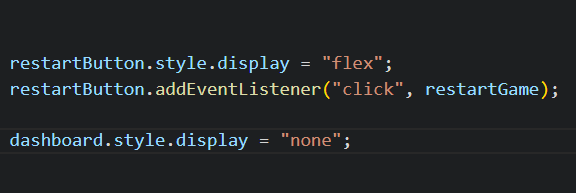

# **Rock Paper Scissors**

## **Site Overview**

The entertaining classic game of chance available for all devices. Play against the computer - the first to score 10 wins.

## **Table Of Contents**

---

1. [**Site Overview**](#site-overview)
2. [**Project Goals**](#project-goals)
   - [Site Owner Goals](#site-owner-goals)
   - [How This Will Be Achieved](#how-this-will-be-achieved)
3. [**UX**](#ux)
   - [Strategy and Scope]
     - [User Stories](#user-stories)
     - [User Requirements](#user-requirements)
   - [Structure and Skeleton](#structure-and-skeleton)
     - [Wireframes](#wireframes)
   - [Current Features](#current-features)
     - [404 Page](#404-page)
   - [Surface](#surface)
     - [Color Scheme](#color-scheme)
     - [Font](#font)
4. [**Testing and Validation**](#testing-and-validation) \* bugs
5. [**Deployment and Development**](#deployment-and-development)
6. [**Credits**](#credits)
   - [Media](#media)
   - [Content](#content)
   - [Code](#code)
   - [Acknowledgements](#acknowledgements)

---

## **Project Goals**

---

### **Site Owner Goals**

- To host a clean, responsive and engaging game and create a consistent and positive user experience across all devices.

### **How This Will Be Achieved**

- The site will be one page with clear instructions and feedback given to the user at all times (e.g. when hovering the mouse, on clicking, results for each round etc)
- Dimensions for an extensive list of screen sizes will be tested.

## **UX**

---

### **Strategy and Scope**

#### **User Stories**

As a user I would like:

- Minimal text for instructions.
- A clean and aesthetically pleasing interface, with game sounds and music.
- A functioning game with consitent outcomes that is enjoyable with no delays or lagging.
- To be able to see my score and have a target.
- To have the option to play again easily.

#### **User Requirements**

| Requirements                         | Importance | Viability |
| ------------------------------------ | :--------: | --------: |
| Game rules                           |     5      |         5 |
| Computer Challenger                  |     5      |         5 |
| Human Challenger                     |     5      |         3 |
| Score tally                          |     5      |         5 |
| Interactive buttons for game choices |     5      |         5 |
| Feedback comment after each round    |     4      |         5 |
| Disable buttons when game ends       |     5      |         5 |
| Restart button                       |     5      |         5 |
| Music                                |     4      |         4 |

For this iteration, all requirements with importance and viability score of 5 have been implemented.

In the next version I would like to source some game music to add to the experience. Based on feedback from testers, the option to play against a friend/stranger emerged as important but not viable at present.

Comments are not essential for functioning of the game (as the score bar updates shows who is winning) but it is a nice form of feedback and engagement for the user.

Initially the choice buttons displayed as text but feedback from testers suggested these be replaced with icons as they were more attractive. This has been implemented.

Buttons before:

Buttons after:

### **Structure and Skeleton**

#### **Wireframe**

#### **Current Features**

##### **1. Header**

##### **2. Rules**

##### **3. Game Area**

##### **4. Game Over**

##### **5. Footer**

## **Surface**

### **Color Scheme**

The color scheme is based on **\*** image. The basic CSS colors: colours 'thistle', indigo and papaywhite were used to compliment these colours.

### **Font**

Both 'sans-serif' fonts, 'Chelsea Market' (for headings) and 'Belanosima''(for player updates) come from Google Fonts.

## **Testing and Validation**

- I tested the game in the following browsers: Chrome, Firefox and Edge.
- The game has been tested on multiple mobile devices in person and via all the available devices on Dev Tools toolbar.
- I confirmed the fonts, colors and all text items are clear, adequately contrasted, legible and easy to understand.
- Initially LightHouse returned a score of 98% as I skipped the use of 'h2' headings and began using 'h3'. This was flagged as bad practice for screen readers and all headings below 'h1' were amended.

### **Bugs**

#### **Solved Bugs**

- I had an issues with my JavaScript syntax which cause my array items not to show. The error was using curved parentheses instead of square ones and this was easily addressed.

- When defining statements to toggle the display, the following did not work:

Only when the dashboard statement was place above the restart statement was the display affected.

- In the restartGame function, player and computer images needed to be re-sourced as without explicitly doing so resulted in the following error:

- At one stage, the computer could not score against player - I did not document this well enough but I think it was another paretheses issue. It has been resolved.

- For most devices, the game will fill the height of the screen. There are a couple of shorter devices - namely the Google Nest Hub - where the sticky footer became an issue and overlapped/hid the scores. This was resolved with a media query where the display was changed to 'relative' on such devices.

#### Validator testing

- HTML
  - One error found - the script tag for the JavaScript file was outside of the body. It should always be at the end of the page for loading reasons but within the body element.

  

  This has been addressed and no there are no HTML errors.

- CSS
  - No errors found

#### **Unfixed bugs**

- There are no unfixed bugs.

## **Deployment and Development**

## **Credits**

#### **Technologies Used**

- [Balsamiq](https://balsamiq.com/) to create the wireframes.
- [HTML5](https://en.wikipedia.org/wiki/HTML) for the content and structure of the site.
- [CSS3](https://en.wikipedia.org/wiki/CSS) for all styling on the site.
- [Codeanywhere](https://codeanywhere.com/) IDE for editing the site.
- [Github](https://github.com/) to host the repository and deploy the site.
- [Google Dev Tools](https://developer.chrome.com/docs/devtools/) to troubleshoot and test ideas

- [Am I Responsive?](https://ui.dev/amiresponsive) to generate an image showing responsivness of the site across multiple devices.

* [Media](#media)
* [Content](#content)
* [Code](#code)
* [Acknowledgements](#acknowledgements)
