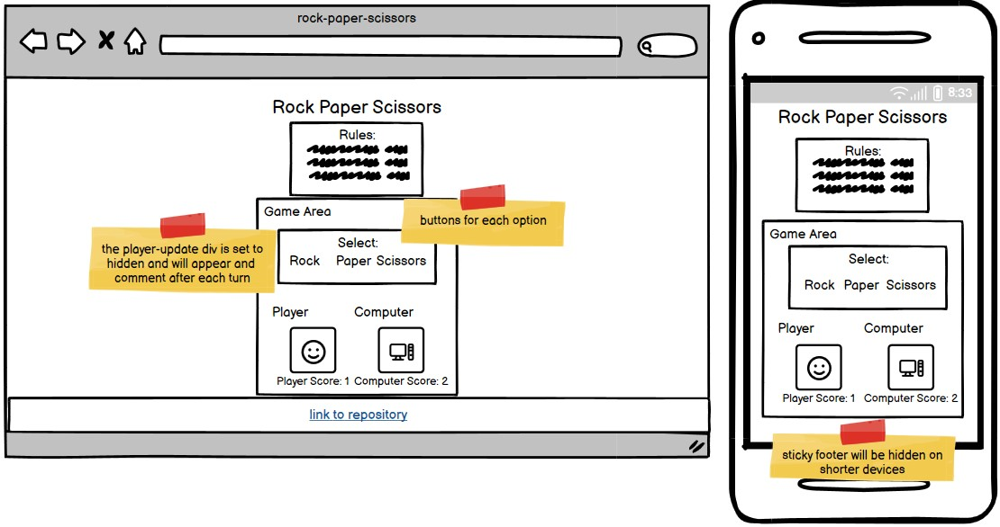

# **Rock Paper Scissors**

## **Site Overview**

The entertaining classic game of chance available for all devices.

Play against the computer - the first to score 10 points wins.

## **Table Of Contents**

1. [**Site Overview**](#site-overview)
2. [**Project Goals**](#project-goals)
   - [Site Owner Goals](#site-owner-goals)
   - [How This Will Be Achieved](#how-this-will-be-achieved)
3. [**UX**](#ux)
   - [Strategy and Scope](#strategy-and-scope)
     - [User Stories](#user-stories)
     - [User Requirements](#user-requirements)
   - [Structure and Skeleton](#structure-and-skeleton)
     - [Wireframes](#wireframes)
   - [Current Features](#current-features)
   - [Surface](#surface)
     - [Color Scheme](#color-scheme)
     - [Font](#font)
4. [**Testing and Validation**](#testing-and-validation)
   - [Bugs](#bugs)
     - [Solved Bugs](#solved-bugs)
     - [Validatior Testing](#validator-testing)
     - [Unfixed Bugs](#unfixed-bugs)
5. [**Deployment and Development**](#deployment-and-development)
6. [**Credits**](#credits)
   - [Technologies Used](#technologies-used)
   - [Media](#media)
   - [Content](#content)
   - [Code](#code)
   - [Acknowledgements](#acknowledgements)

---

## **Project Goals**

### **Site Owner Goals**

- To host a clean, responsive and engaging game and create a consistent and positive user experience across all devices.

### **How This Will Be Achieved**

- The site will be one page with clear instructions and feedback given to the user at all times (e.g. when hovering the mouse, on clicking, results for each round etc)
- Dimensions for an extensive list of screen sizes will be tested.

---

## **UX**

### **Strategy and Scope**

#### **User Stories**

As a user I would like:

- Minimal text for instructions.
- A clean and aesthetically pleasing interface, with game sounds and music.
- A functioning game with consitent outcomes that is enjoyable with no delays or lagging.
- To be able to see my score and have a target.
- To have the option to play again easily.

#### **User Requirements**

| Requirements                         | Importance | Viability |
| ------------------------------------ | :--------: | --------: |
| Game rules                           |     5      |         5 |
| Computer Challenger                  |     5      |         5 |
| Human Challenger                     |     5      |         3 |
| Score tally                          |     5      |         5 |
| Interactive buttons for game choices |     5      |         5 |
| Feedback comment after each round    |     4      |         5 |
| Disable buttons when game ends       |     5      |         5 |
| Restart button                       |     5      |         5 |
| Music                                |     4      |         4 |

For this iteration, all requirements with importance and viability score of 5 have been implemented.

In the next version I would like to source some game music to add to the experience. Based on feedback from testers, the option to play against a friend/stranger emerged as important but not viable at present.

Comments are not essential for functioning of the game (as the score bar updates and shows who is winning) but it is a nice form of feedback and engagement for the user.

Initially the choice buttons displayed as text but feedback from testers suggested these be replaced with icons as they were more attractive. This has been implemented.

Buttons before:

Buttons after:

### **Structure and Skeleton**

#### **Wireframe**

#### **Current Features**

##### **1. Header**

- Displays the game title 'Rock Paper Scissors', in large contrasted text.

##### **2. Rules**

- A reminder of the rules featuring some FontAwesome icons.

##### **3. Game Area**

- Here the player will interact with the buttons to make their choices. JavaScript will generate choices for the computer player.

- The player update div will give live commentary on who is winning by test while the score updates below in purple font to make it stand out.

- Communication is clear and consise to the player.

##### **4. Game Over**

- When the round is won - a new button appears with the option to resart the game.

##### **5. Footer**

- The footer is 'sticky', it gives a solid bottom to the page. A link to my GitHub page is there if the user wishes to visit the repository.

### **Surface**

#### **Color Scheme**

The basic CSS colors: 'thistle', 'indigo' and 'papaywhite' were used to compliment the colors of the 'Rock, Paper, Scissors' image (colors identified using [Adobe Color Image](https://color.adobe.com/create/image).)

#### **Font**

Both 'sans-serif' fonts, 'Chelsea Market' (for headings) and 'Belanosima''(for player updates) come from Google Fonts.

---

## **Testing and Validation**

- I tested the game in the following browsers: Chrome, Firefox and Edge.
- The game has been tested on multiple mobile devices in person and via all the available devices on Dev Tools toolbar.
- I confirmed the fonts, colors and all text items are clear, adequately contrasted, legible and easy to understand.
- Initially LightHouse returned a score of 98% as I skipped the use of 'h2' headings and began using 'h3'. This was flagged as bad practice for screen readers and all headings below 'h1' were amended.

### **Bugs**

#### **Solved Bugs**

- I had an issues with my JavaScript syntax which cause my array items not to show. The error was using curved parentheses instead of square ones and this was easily addressed.

- When defining statements to toggle the display, the following did not work:

Only when the dashboard statement was defined above the restart statement was the display affected.

- In the restartGame function, player and computer images needed to be re-sourced as without explicitly doing so resulted in the following error:

- At one stage, the computer could not score against player - I did not document this well enough but I think it was another paretheses issue. It has been resolved.

- The hover effects still appears when a button is disabled. I found this bad for UX and as the buttons were no longer needed after the game ends I chose to hide them instead.

- For most devices, the game will fill the height of the screen. There are a couple of shorter devices - namely the Google Nest Hub - where the sticky footer became an issue and overlapped/hid the scores. This was resolved with a media query where the display was changed to 'relative' on such devices.

#### **Validator testing**

- HTML

  - One error found - the script tag for the JavaScript file was outside of the body. It should always be at the end of the page for loading reasons but within the body element.

  

  This has been addressed and no there are no HTML errors.

- CSS
  - No errors found

#### **Unfixed bugs**

- There are no unfixed bugs.

---

## **Deployment and Development**

The site was deployed to GitHub pages using the following steps:

1. In the GitHub repository, navigate to the Settings tab from the horizontal menu at the top of the page.
2. Click the Settings tab and locate the Pages tab on the left menu which appears.
3. Once you've selected your branch and root directory, click "Save" to deploy your website. GitHub will generate a URL (usually in the format username.github.io/repository-name).
4. A message will be displayed to indicate a successful deployment to GitHub pages and provide the live link.

The live link can be found here - [Rock Paper Scissors](https://modonohoe.github.io/rock-paper-scissors/)

---

## **Credits**

### **Technologies Used**

- [Balsamiq](https://balsamiq.com/) to create the wireframes.
- [Codeanywhere](https://codeanywhere.com/) IDE for editing the site.
- [Github](https://github.com/) to host the repository and deploy the site.
- [Google Dev Tools](https://developer.chrome.com/docs/devtools/) to troubleshoot and test ideas
- [Am I Responsive?](https://ui.dev/amiresponsive) to generate an image showing responsivness of the site across multiple devices.

### **Media**

- [Vecteezy.com](https://www.vecteezy.com/free-vector/rock-paper-scissors) the The image for the rock, paper and scissors.
- [Google Fonts](https://fonts.google.com/) to source and import all fonts.
- [Font Awesome](https://fontawesome.com/) for the icons in the rules section and GitHub icon in footer.
- [Favicon](https://favicon.io/) where the site's favicon was sourced.

### **Code**

- Two JavaScript functions were adopted from the 'Rock, Paper, Scissors' walkthrough by Matt Rudge via Code Institute.

- I found this article helpful regarding font-sizing and rem [Why I change the font size to 62.5%](https://javascript.plainenglish.io/why-i-change-the-font-size-to-62-5-in-every-project-45c5ff785fb5)

### **Acknowledgements**

- Thank you to Code Institute - the content creators, my mentor, the tutors and the Slack community who all contributed to my understanding of JavaScript fundamentals during this project.

[Return to top](#table-of-contents)
